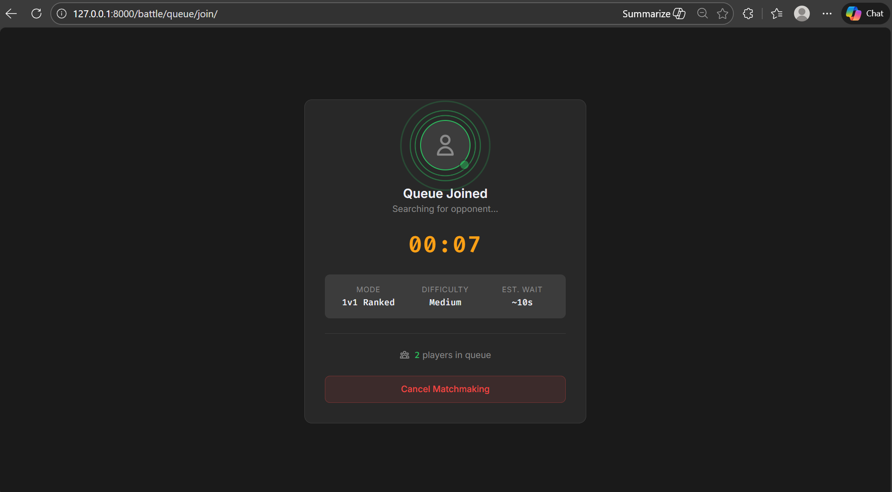
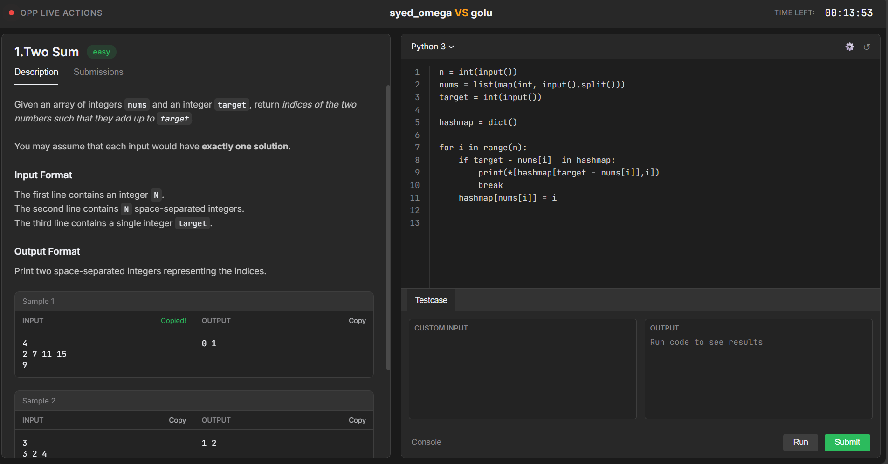
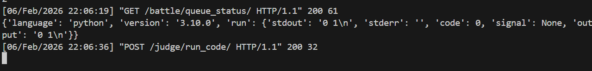
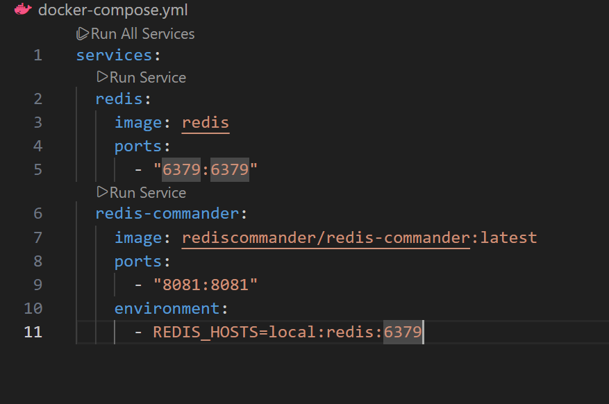
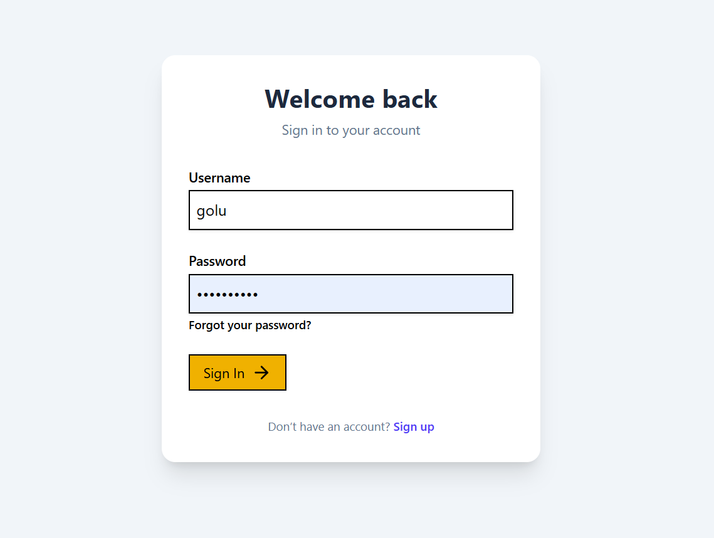

# ClashOfCode (In Development 50% done)

A real-time 1v1 competitive programming arena built on Django, Celery, and Redis. The project focuses on matchmaking, live battle flow, and automated judging via the Piston API. Channels is wired at the ASGI layer, and the system is structured to evolve into WebSocket-driven live updates.

## Screenshots

### Queue and Matchmaking


### Battle Arena


### Judge Results


### Redis + Docker (Matchmaking Background Worker)


### Auth (Login / Signup)


## Why This Project
ClashOfCode showcases:
- Real-time-ish gameplay via queue polling + battle redirection.
- Distributed background work (Celery + Redis) for matchmaking.
- External code execution using Piston (language-agnostic).
- Dynamic content loading from database-backed problems.
- A growing architecture ready for WebSocket enhancements.

## Tech Stack
- Backend: Django 6.0.1
- Async/Tasks: Celery + django-celery-beat
- Broker: Redis
- Real-time foundation: Django Channels (ASGI router)
- Judge: Piston API (emkc.org)
- Frontend utilities: Tailwind CSS (CLI)
- Database: SQLite (dev)
- Runtime: Python (Django), Node (Tailwind build)

## Repository Layout
```
ClashOfCode/
├─ clashofcode/                 # Django project root
│  ├─ battle/                   # Matchmaking + battle arena
│  ├─ Judge/                    # Run & submit endpoints (Piston)
│  ├─ Users/                    # Auth views + templates
│  └─ clashofcode/              # Settings, ASGI, Celery, URLs
├─ docker-compose.yml           # Redis + Redis Commander
├─ commands.txt                 # Celery worker/beat commands
├─ tests/                       # Sample tests (not used by judge yet)
└─ main.cpp / judge.py          # Local execution helpers
```

## Core Flow (End-to-End)
1. User logs in (Django auth + custom templates).
2. User joins queue (`/battle/queue/join/`).
3. Celery task periodically matches two waiting users.
4. Both users poll `/battle/battle_status/` until a match is found.
5. Users are redirected to `/battle/battle_arena/<battle_id>/`.
6. Arena loads problem dynamically from the DB.
7. Run & Submit calls judge endpoints which execute via Piston.

## Implemented Features (Detailed)

### 1) Matchmaking Queue
- **Queue entry**: Creates a `MatchmakingTicket` for the current user.
- **Queue exit**: Deletes active waiting ticket.
- **Polling**: Queue size and ETA returned by `queue_status`.
- **Ticket cleanup**: Matched tickets are removed when the user acknowledges the match.

Key components:
- `battle.views.join_queue`
- `battle.views.leave_queue`
- `battle.views.queue_status`
- `battle.views.battle_status`
- `battle.views.acknowledge_match`

### 2) Celery Matchmaking
- Celery task matches users in FIFO order (oldest tickets first).
- Uses `select_for_update(skip_locked=True)` to avoid double-assign.
- Chooses a random problem from `Problems`.
- Creates a `Battle`, updates both tickets to `matched`.
- Task loops up to 10 pairings per execution.

Key task:
- `battle.tasks.run_matchmaking`

Scheduler:
- `django_celery_beat` database scheduler.
- Broker at `redis://localhost:6379`.

### 3) Dynamic Problem Loading
- `Battle` references a `Problems` object.
- Problem includes title, description, difficulty, I/O formats, samples, explanation.
- `battle_arena` view fetches problem and injects it into template.

### 4) Judge System (Piston)
**Two workflows:**
- **Run** (`/judge/run_code/`): Executes user code on custom input.
- **Submit** (`/judge/submit_code/`): Executes against all sample cases.

Verdict logic:
- Compile error -> `CE`
- Runtime error -> `RE`
- Output mismatch -> `WA`
- All samples pass -> `AC`

Language mapping is normalized via `LANG_FILE_MAP`:
- Python, C, C++, Java, Go, JS are currently supported.

### 5) Auth / Users
- Custom login and signup views in `Users` app.
- Uses standard Django auth backend.
- Templates are in `Users/templates/authentication`.

### 6) Channels / WebSockets (Prepared)
- `channels` is installed.
- ASGI application uses `ProtocolTypeRouter` with HTTP configured.
- WebSocket routing not added yet, but scaffold is in place.

## HTTP Endpoints

### Auth
- `/users/login_user` (GET/POST)
- `/users/signup_user` (GET/POST)

### Battle
- `/battle/queue/join/`
- `/battle/queue/leave/`
- `/battle/queue_status/`
- `/battle/battle_status/`
- `/battle/acknowledge_match/<battle_id>/`
- `/battle/battle_arena/<battle_id>/`

### Judge
- `/judge/run_code/` (POST JSON)
- `/judge/submit_code/` (POST JSON)

## Data Model Overview

### `Problems`
- `title`, `description`, `difficulty`
- `input_format`, `output_format`
- `samples` (JSON list of {input, output})
- `explanation`, `created_at`

### `Battle`
- `id` (UUID string primary key)
- `user_a`, `user_b`
- `problem`
- `status`, `winner`
- `started_at`, `ended_at`

### `MatchmakingTicket`
- `user`, `ticket_id`, `status`
- `battle` (nullable)
- `created_at`

### `Submissions`
- user, problem, battle
- language, code
- status, verdict
- exec_time_ms, memory_kb, points
- compiler_output, stdout, stderr
- created_at, judged_at

## Local Setup

### 1) Python Environment
```sh
python -m venv .venv
.venv\Scripts\activate
pip install -r requirements.txt
python manage.py migrate
python manage.py runserver
```

### 2) Redis (Docker)
```sh
docker compose up -d
```

Redis Commander will be available on `http://localhost:8081`.

### 3) Celery Worker + Beat
```sh
celery -A clashofcode worker -l INFO
celery -A clashofcode beat -l INFO --scheduler django_celery_beat.schedulers:DatabaseScheduler
```

### 4) Tailwind CSS
```sh
npm install
npm run tailwind:build
```

## How the Queue + Match Works (Step-by-Step)
1. `join_queue` creates a `MatchmakingTicket` in `waiting` state.
2. Celery Beat schedules `run_matchmaking`.
3. Task locks two waiting tickets (FIFO) and picks a random problem.
4. A `Battle` is created with both users and the problem.
5. Tickets are updated to `matched` and store the `battle` link.
6. Clients poll `battle_status` and are redirected to arena.
7. `acknowledge_match` deletes the ticket (user is now in battle).

## Judge API Request Contract

### `POST /judge/run_code/`
```json
{
  "battle_id": "<uuid>",
  "language": "cpp",
  "version": "*",
  "code": "...",
  "input": "1 2"
}
```

### `POST /judge/submit_code/`
```json
{
  "battle_id": "<uuid>",
  "language": "cpp",
  "version": "*",
  "code": "..."
}
```

Responses are JSON with `status` and `output` or `message` fields.

## Current Limitations / Pending Items
- No WebSocket routing yet (Channels is installed, HTTP only).
- No hidden tests / scoring logic for submissions.
- Minimal battle state tracking (no timeout or live result sync).
- No ELO/ratings system.
- No multi-battle history UI.
- Security hardening and production config not done yet.

## Notes for Recruiters
This project intentionally emphasizes real-world architecture patterns:
- **Async orchestration** via Celery + Redis.
- **Fairness and isolation** through external judge execution.
- **Composable app design** with clear Django app boundaries.
- **Scalable real-time path** via ASGI/Channels foundation.

The codebase is structured so that WebSocket streams, match timers, and
live verdict updates can be layered on without rewriting the battle flow.

## Quick Reference
- Settings: `clashofcode/clashofcode/settings.py`
- ASGI entry: `clashofcode/clashofcode/asgi.py`
- Matchmaking task: `clashofcode/battle/tasks.py`
- Judge endpoints: `clashofcode/Judge/views.py`
- Battle views: `clashofcode/battle/views.py`
- Auth views: `clashofcode/Users/views.py`
